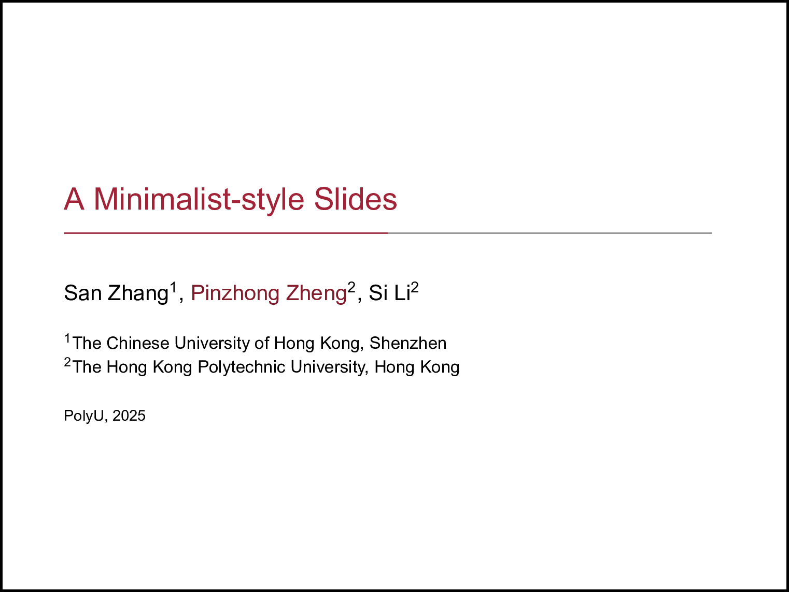
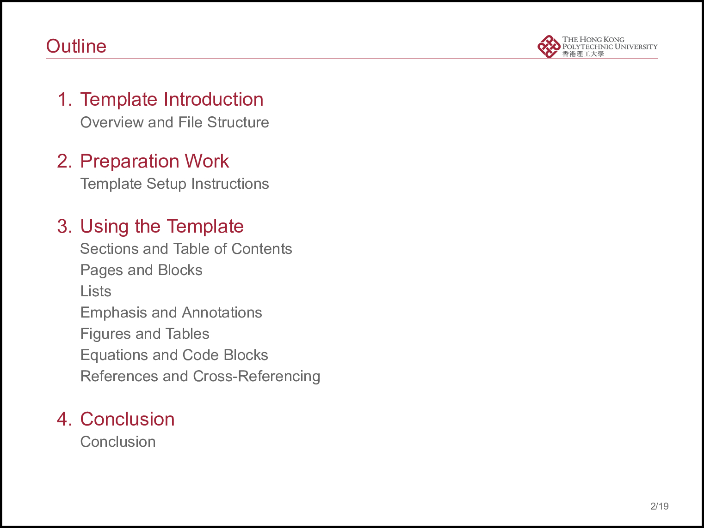
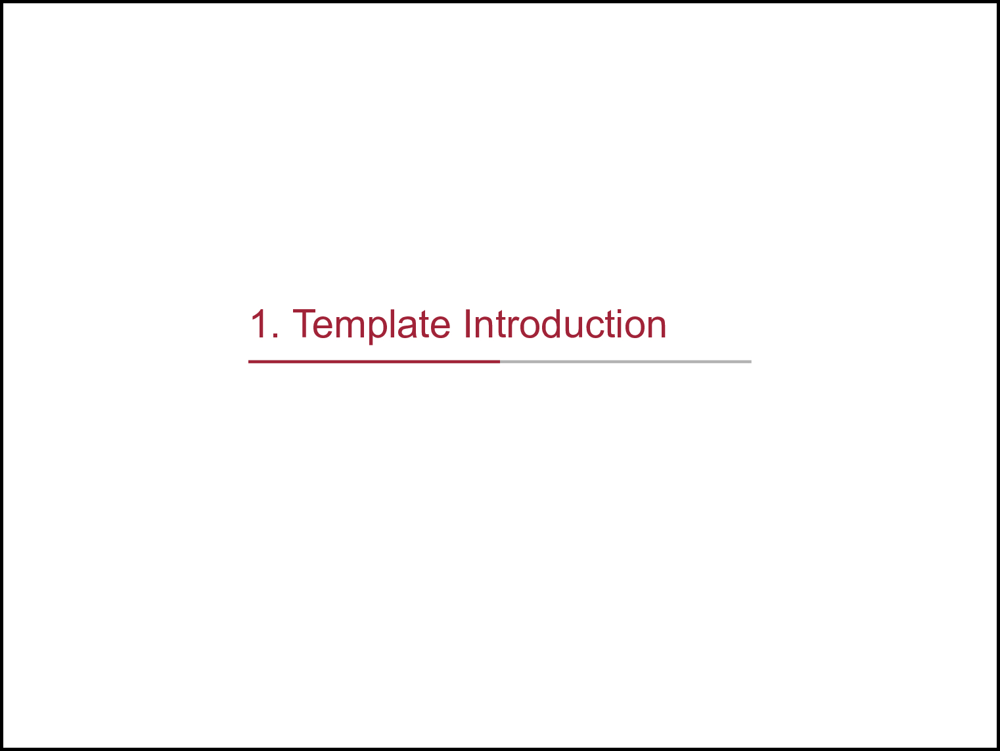
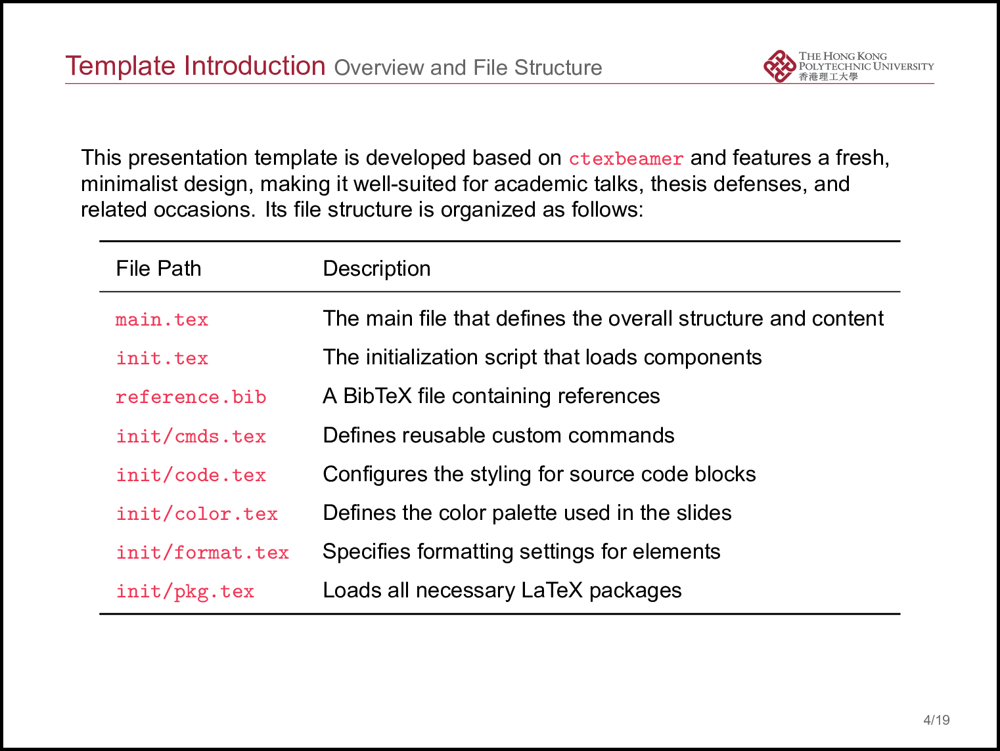
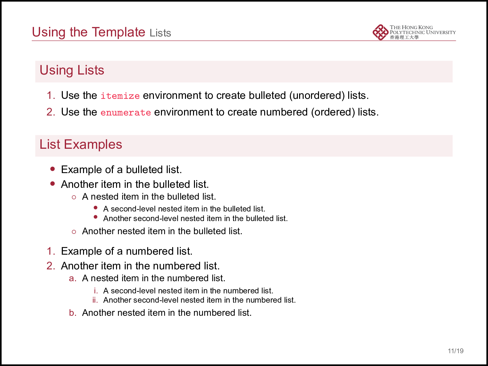
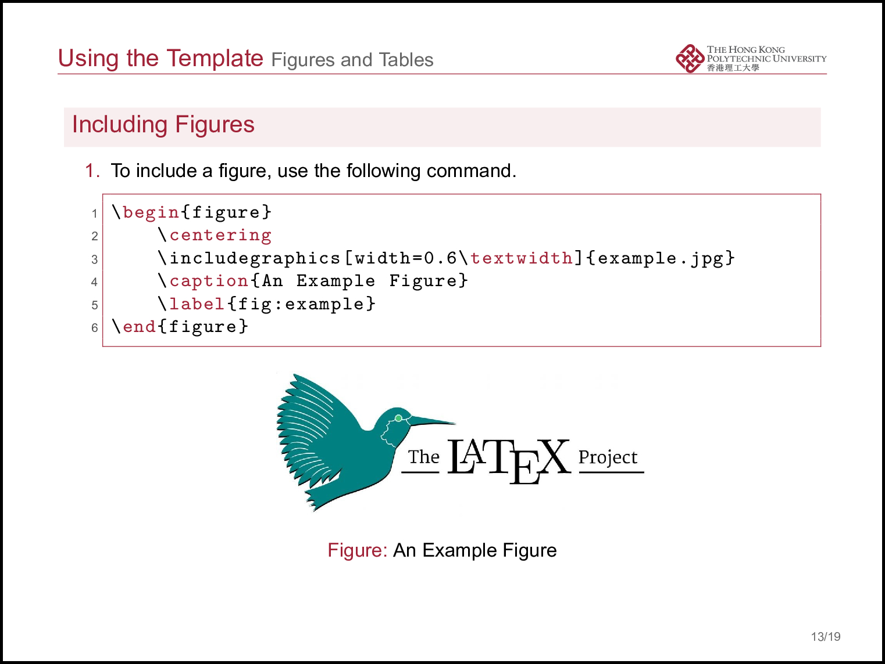
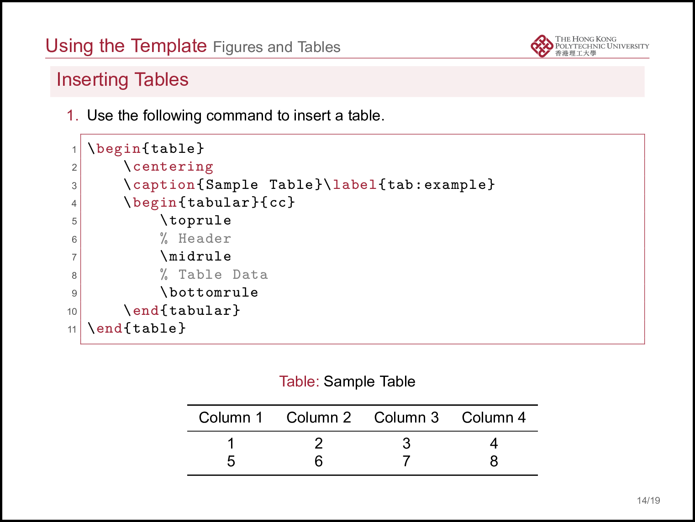
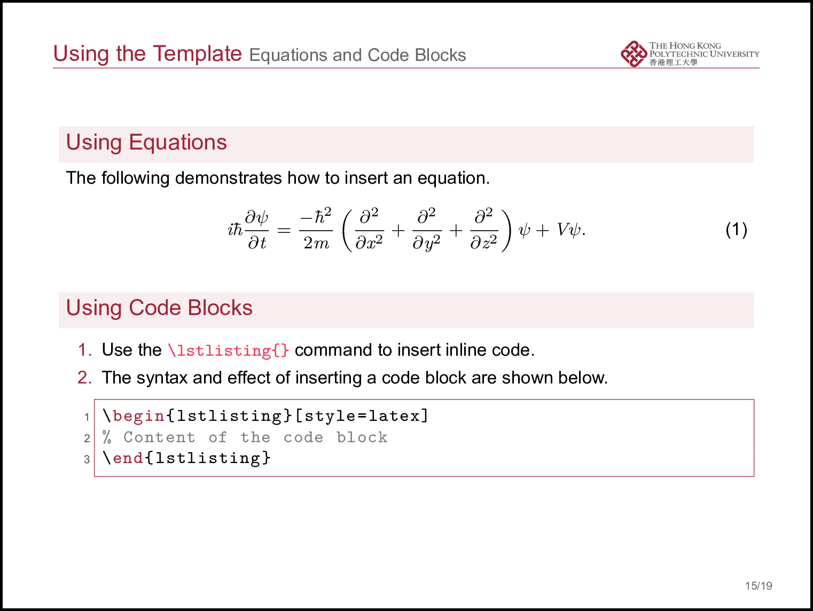

# Minimalist Slides

This minimalist slide template, built on LaTeX Beamer, features a **The Hong Kong Polytechnic University** theme by default. Users can effortlessly tailor it to reflect the branding of other institutions with minimal adjustments.

## Features

- Clean and elegant design, well-suited for academic presentations, thesis defenses, and similar professional settings
- Seamless integration of images, tables, equations, and code blocks
- Fully customizable theme color options

## Example

- Shown below are the default **Hong Kong Polytechnic University** theme styles:

<p align="center">
  
  
  
  
  
  
  
  
</p>

## Usage Instructions & Additional Information

For complete usage guidelines and more details, please consult the `main.pdf` file.

> **Compilation instructions**:  
> The template is suitable for Chinese and English. To properly compile this template with bibliography support, please use the following sequence:
>
> ```
> xelatex main.tex
> bibtex main
> xelatex main.tex
> xelatex main.tex
> ```

Make sure you have `XeLaTeX` and `BibTeX` installed, and that your LaTeX editor (e.g., TeXstudio, Overleaf, VSCode + LaTeX Workshop) is configured to follow this compilation chain.